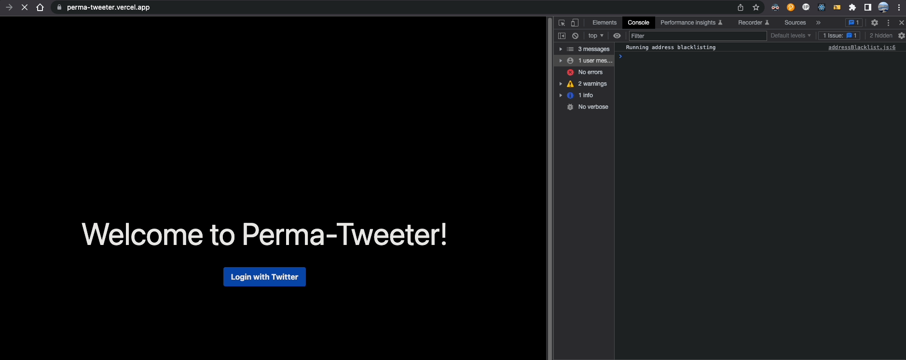
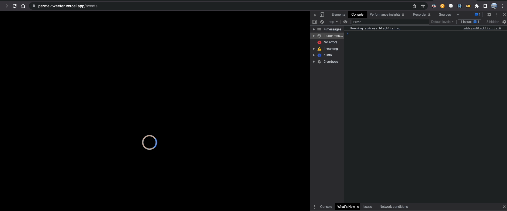

An app to help you save your X posts to [Subsocial](https://subsocial.network/), making them permanent and censorship-resistant in the blockchain. 

Built using Next.js, Subsocial SDK, and node-twitter-api-v2.

## Features Checklist

✅ Login to your Twitter account (using NextAuth Provider)

✅ Show your X posts (excluding replies, text-only)

✅ Choose X posts to backup (limited to 2 X posts each submission)

✅ Submit X posts to SoonSocialX (Subsocial testnet) via Subsocial SDK

## App Demo



Logging in using your own Twitter account and submitting X posts to be sent to Subsocial chain




X posts sent and submission successful

Example of succesful txs (connect to SoonSocialX network on Polkadot.js apps):

[Creating a single post](https://polkadot.js.org/apps/?rpc=wss%3A%2F%2Frco-para.subsocial.network#/explorer/query/0xf154347d77ac55d8a9a7e1c53f9e30ee49dacdfd50222f027a6e4df8f8c45d52)

[Creating batch posts](https://polkadot.js.org/apps/?rpc=wss%3A%2F%2Frco-para.subsocial.network#/explorer/query/0xdd387d5bb462cd11ba2835752bb66b3a5bbea8d5e485d355d825822276b93a04)

NOTE: Currently, the app is only tested on the latest version of Google Chrome.

## Getting Started

First, run the development server:

```bash
npm run dev
# or
yarn dev
```

Open [http://localhost:3000](http://localhost:3000) with your browser to see the result.

You can start editing the page by modifying `pages/index.tsx`. The page auto-updates as you edit the file.

[API routes](https://nextjs.org/docs/api-routes/introduction) can be accessed on [http://localhost:3000/api/hello](http://localhost:3000/api/hello). This endpoint can be edited in `pages/api/hello.ts`.

The `pages/api` directory is mapped to `/api/*`. Files in this directory are treated as [API routes](https://nextjs.org/docs/api-routes/introduction) instead of React pages.

## Learn More

To learn more about Next.js, take a look at the following resources:

- [Next.js Documentation](https://nextjs.org/docs) - learn about Next.js features and API.
- [Learn Next.js](https://nextjs.org/learn) - an interactive Next.js tutorial.

You can check out [the Next.js GitHub repository](https://github.com/vercel/next.js/) - your feedback and contributions are welcome!

## Deploy on Vercel

The easiest way to deploy your Next.js app is to use the [Vercel Platform](https://vercel.com/new?utm_medium=default-template&filter=next.js&utm_source=create-next-app&utm_campaign=create-next-app-readme) from the creators of Next.js.

Check out our [Next.js deployment documentation](https://nextjs.org/docs/deployment) for more details.
